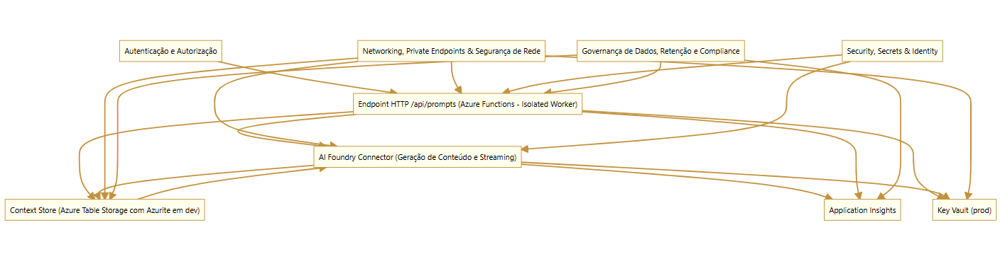
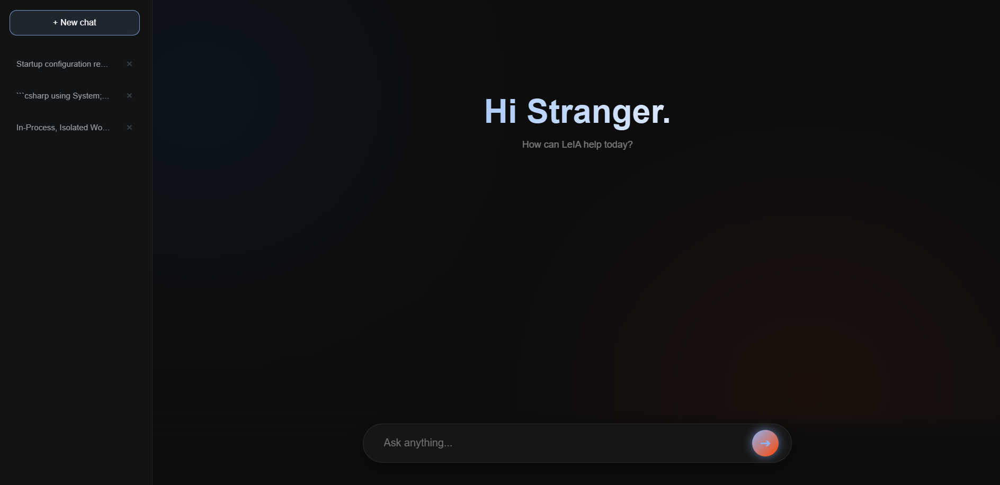
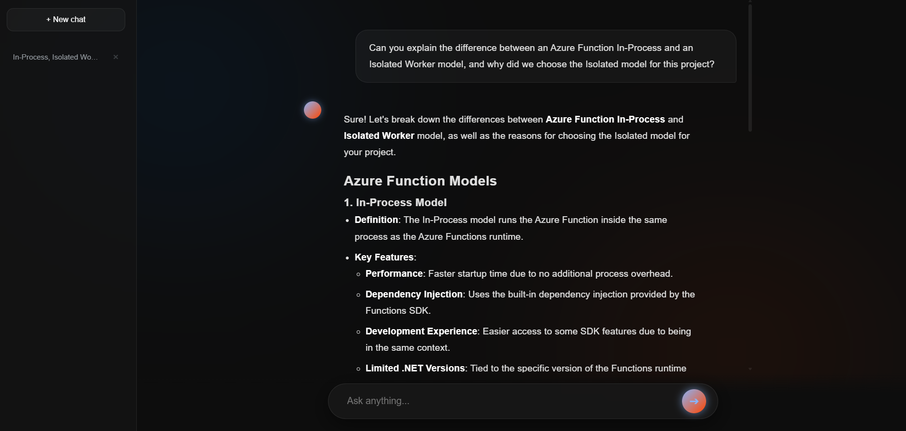

# 🤖 LeIA - Multimodal AI-Powered Assistant (Azure Serverless)

**LeIA** is a scalable, enterprise-grade **Multimodal Assistant** built on a **Serverless Architecture** using Microsoft Azure. The system is capable of processing both **text and image inputs**, providing real-time streaming responses and automated session context management.

---

## 🏗️ System Architecture

The solution follows cloud-native patterns to ensure high availability, security, and low latency. Below is the architectural design for production environments:

*Figure 1: Detailed architectural design and data flow.*

---

## 📸 Interface & User Experience

The frontend is a responsive chat interface that consumes the **Server-Sent Events (SSE)** stream from the backend.

### **Initial State**
When a new session starts, the assistant is ready to receive instructions with a clean, intuitive interface.

*Figure 2: Welcome screen and sidebar session management.*

### **Multimodal Capabilities (Vision 🚀)**
The assistant now supports **Computer Vision**. Users can upload images directly into the chat, which are processed via **Base64 encoding** and analyzed by the **GPT-4o-mini** model to provide context-aware insights.

*Figure 3: Real-time token streaming and multimodal responsiveness.*

---

## 🛠️ Key Components & Technologies

### **Backend Engineering**
* **Azure Functions (.NET 8 Isolated Worker)**: High-performance ingestion layer using the latest isolated process model for asynchronous tasks.
* **C# / .NET 8**: Strongly typed logic ensuring reliability, clean architecture, and efficient memory management.

### **AI & Multimodality**
* **Azure OpenAI / AI Foundry (GPT-4o-mini)**: Leveraging **Multimodal LLMs** to handle complex text instructions and image reasoning.
* **Image Processing**: Custom backend logic for handling and preparing image buffers for AI inference.
* **Azure Table Storage**: Partitioned by `sessionId` for efficient, low-cost persistence of chat history and multimodal context.

---

## 🛡️ Security & Governance

Security was a priority in this architecture, following high standards for enterprise solutions:

1. **Secret Management**: All sensitive data (API Keys, Endpoints) are securely stored and retrieved from **Azure Key Vault**.
2. **Managed Identity (MSI)**: Implemented **Passwordless Authentication** between services (Functions -> Key Vault -> OpenAI), eliminating hardcoded credentials.
3. **Data Governance**: Logic implemented for session isolation and data persistence.

---

### **Author**
**Leandro Bueno** - *Full-Stack Developer*
